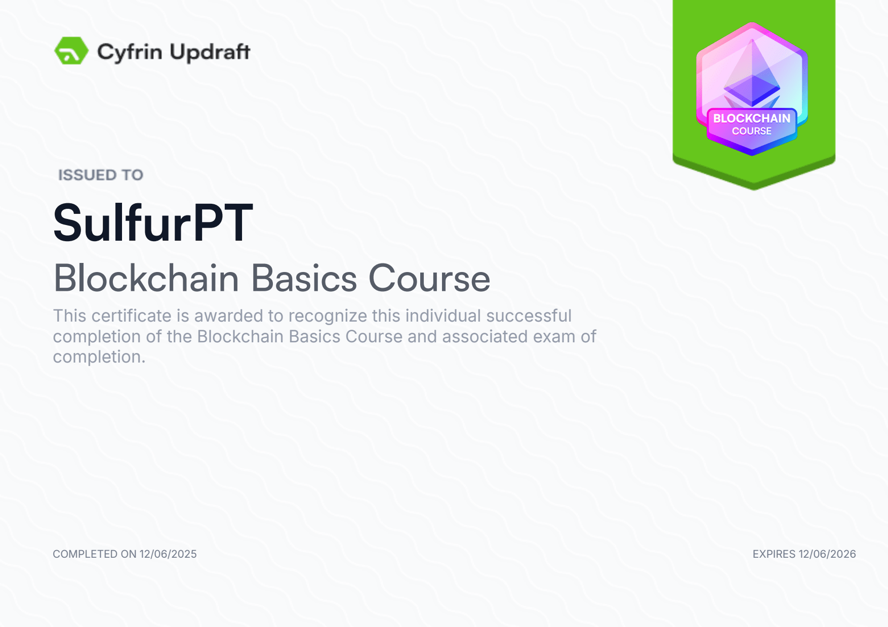
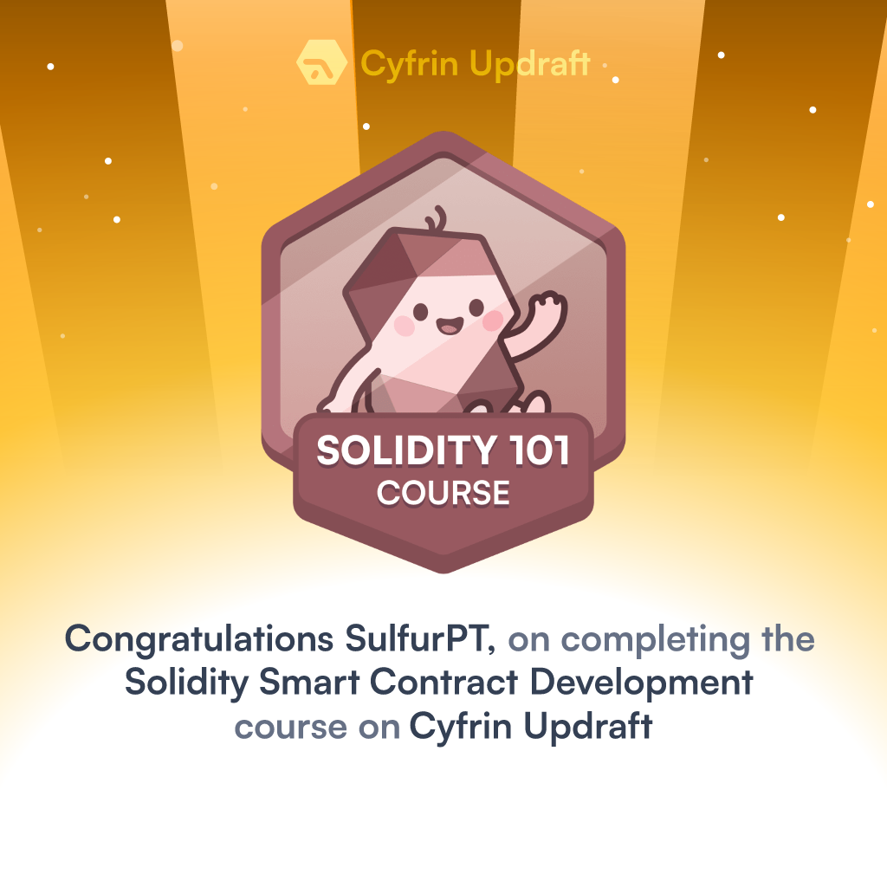
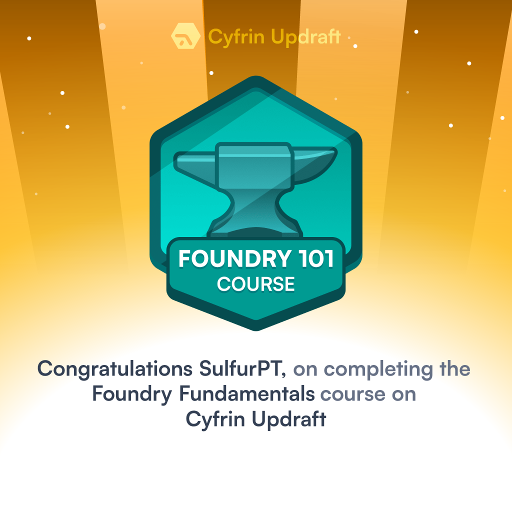
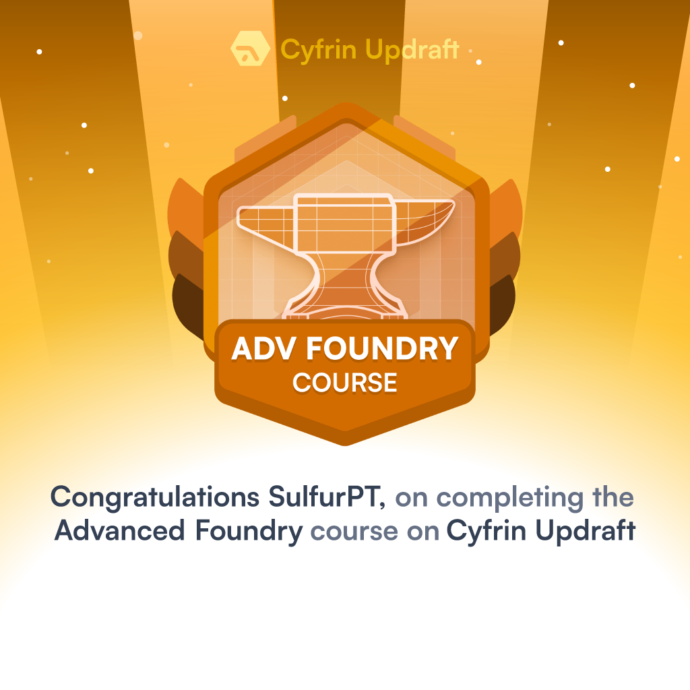
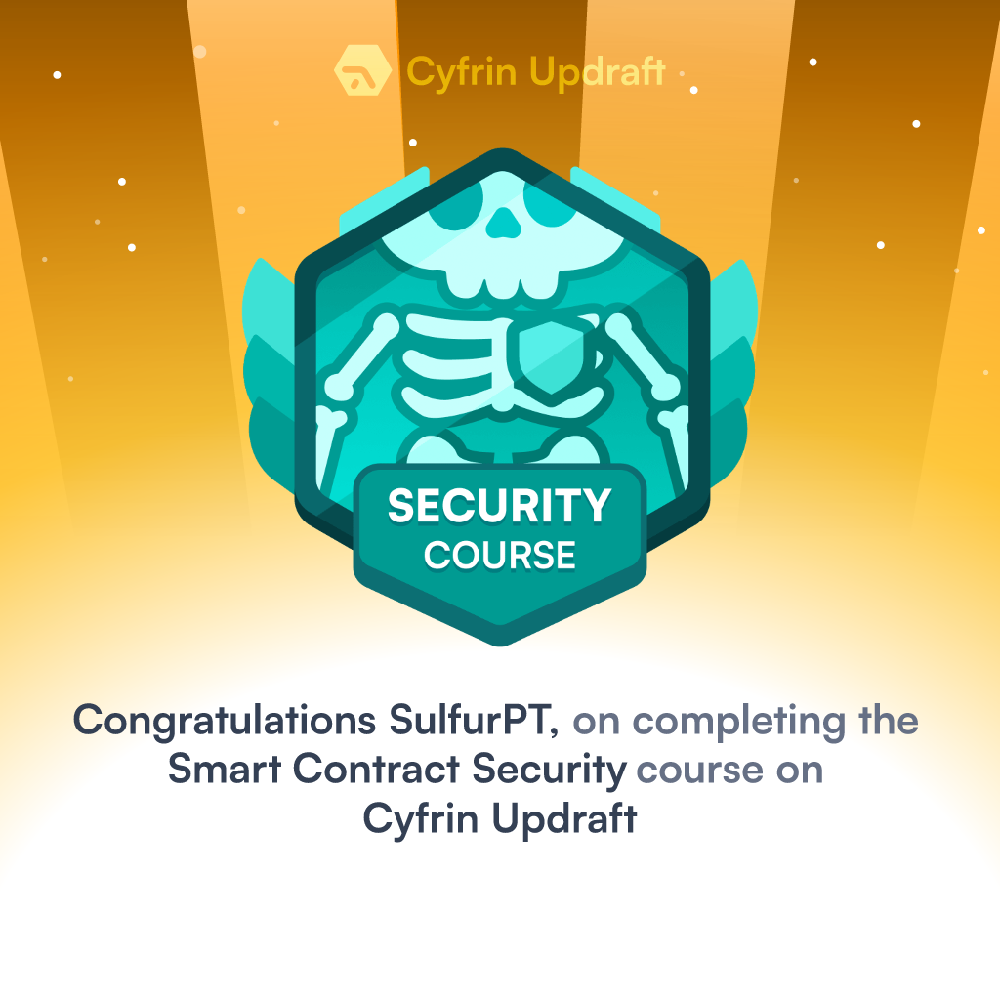
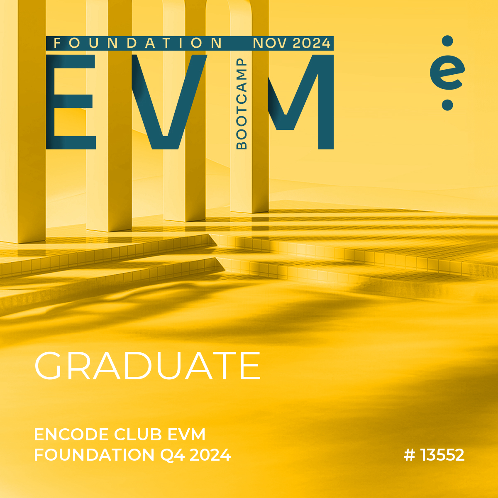
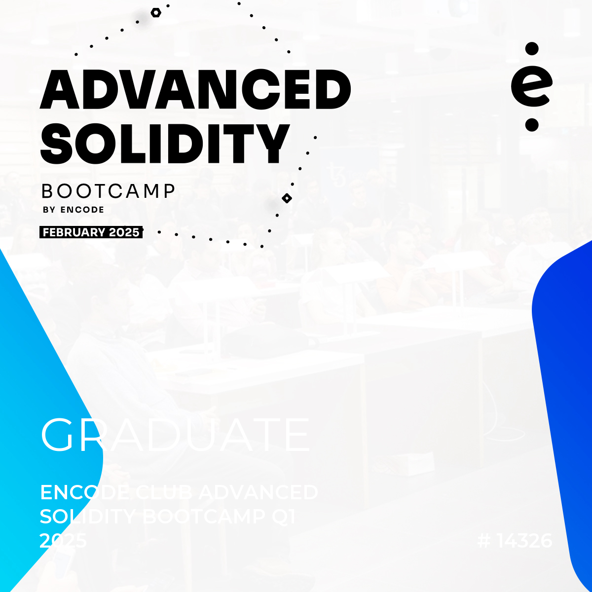

<!-- HEADER -->
<h1 align="center">👋 Hey</h1>

  
  
  

  Pentester transitioning into Web3 Security, currently focused on mastering <b>Solidity</b>, <b>EVM internals</b>, and <b>DeFi protocols</b>. 
  Building a portfolio through <b>CodeHawks First Flights</b>, <b>private audits</b>, <b>contests</b>, <b>bug bounties</b>, and <b>deep technical research</b>.

  <i>Pentester | Web3 Security Researcher | Smart Contract Auditor (in training)</i>

---

## 🧩 Background

- 🧠 15+ years of experience in **IT**, from **Help desk** → **Linux SysAdmin** → **DevOps** → **Pentester/PTaaS** → **Offensive Security Manager**.  
- ⚙️ Strong background in **automation, scripting**, and **infrastructure management** (Python, Bash, C/C#).  
- 🔒 5+ years in **Offensive Security**, including **PTaaS**, **Vulnerability Research**, and **Red Teaming**.  
- 🧱 Currently focused on **Smart Contract Auditing** and **DeFi protocol security**, bridging Web2 expertise with Web3 technology.

---

## 🧰 Tech Stack

#### Web3 / Smart Contract Auditing
- **Solidity** · **Foundry** · **EVM**  
- Auditing production-ready smart contracts and research-driven blockchain projects  
- Gas optimization, security best practices, and vulnerability analysis  
- Participation in [**CodeHawks First Flights**](https://github.com/SulfurPT/CodeHawks-First-Flight), [**Private Audits**](https://github.com/SulfurPT/security_audits), [**Contests**](https://github.com/SulfurPT/security_audits)

#### Security & Auditing Tooling
- **Fuzzing & Formal verification** · **Slither** · **Aderyn** · **Echidna**  
- Threat modeling, architecture review, and PoC development for on-chain security  

#### Pentesting / Offensive Security (condensed)
- **PTaaS (Pentesting-as-a-Service)** · Web apps · APIs · Cloud · Internal · External · Wi-Fi · Mobile  
- **Python** · **Bash** · **C** · **C#** · **Linux** · **Windows**  
- Methodologies: PTES, OWASP; reporting, remediation planning  

---

## 🎓 Certifications & Courses

### 🧠 Cyfrin Updraft

  <b>Blockchain Basics Course</b> 
  

  <b>Solidity Smart Contract Development</b> 
  

  <b>Foundry Fundamentals</b> 
  

  <b>Advanced Foundry</b> 
  

  <b>Smart Contract Security</b> 
  

---

### 🚀 Encode Club

  <b>EVM Bootcamp</b> 
  

  <b>Advanced Solidity Bootcamp</b> 
  

---

### 🧩 Smart Contract Hacking (SCH)

  <b>Smart Contract Hacking</b> 
  

---

## 🔬 Current Focus
 
- Building a deep understanding of **on-chain risk surfaces**  
- Analyzing **real protocol vulnerabilities** and creating **PoCs**  
- Preparing for **formal Web3 security audits** ([**Code4rena**](https://code4rena.com/@SulfurPT) / [**Sherlock**](https://audits.sherlock.xyz/watson/sulfurpt) / [**Cantina**](https://cantina.xyz/u/sulfurpt))

---

## 📂 Key Repositories

- 🛡️ [**Security Audits**](https://github.com/SulfurPT/security_audits) — Smart contract audits, findings & reports  
- 🦅 [**CodeHawks First Flights**](https://github.com/SulfurPT/CodeHawks-First-Flight) — Public First Flight submissions  

---

## 📫 Connect with Me

  
  

---

<i>“Breaking things to make them safer.”</i>

